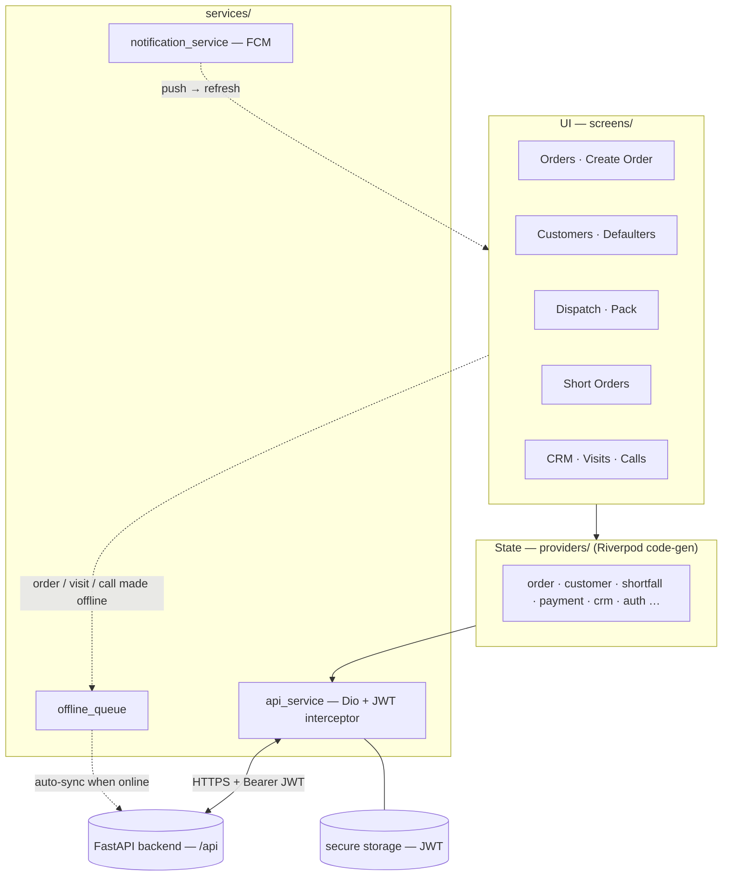
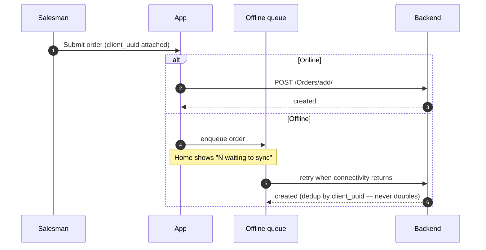
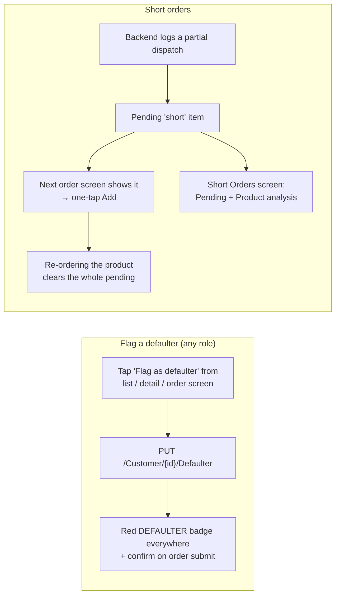

# Orderly — Mobile App (Flutter)

The Android app for **Orderly** — an order-management + field-sales CRM for a
two-business auto-parts distributor (**AAGAM ET** and **VARDHMAN MT**). Salesmen
take orders (offline-capable) and plan their day; warehouse staff pack &
dispatch; admins manage users, catalogues, and CRM settings.

- **Stack:** Flutter · Riverpod (code-gen) · go_router · Dio · flutter_secure_storage
- **Backend:** the FastAPI service (base URL set in `lib/utils/constants.dart`)
- **Package name:** `aagam_order`

---

## Architecture & data flow

### App architecture (layers)


### Offline-safe order submit


### Defaulter & short-order UX


---

## Features — screen by screen

### Core
| Screen | What it does |
|---|---|
| **Login** | Email/password sign-in; JWT stored securely; auto-redirects on expiry. |
| **Home** | Role-based navigation grid + a badge showing items waiting to sync offline. |
| **Profile** | View name/role, log out; Admin can jump to Create User. |

### Orders
| Screen | What it does |
|---|---|
| **Orders** | List of all orders (or "my orders"); status chips; pack/dispatch actions for staff. |
| **Create Order** | Pick a customer + line items (searchable product dropdowns), payment mode; **works offline** (queues and auto-syncs), de-duplicated so a dropped connection never creates a double order. Also surfaces the customer's **pending short items** (one-tap add) and a **DEFAULTER** warning banner + confirm when the customer is flagged. |
| **Edit Order** | Change items/customer/payment; edits are attributed to the editor on the backend. |
| **Order Detail** | Items, payment, status, and a "Last edited by …" line; each item shows its unit MRP; staff see Pack / Dispatch / Edit / Delete. |

### Customers, Products, Payments, Catalogues
| Screen | What it does |
|---|---|
| **Customers** | Searchable list; each row shows shop + contact. |
| **Customer Detail** | Info card with **tap-to-call** (opens the dialer) + a call button; tabs for the customer's Orders and Payments; edit sheet. |
| **Create Customer** | Add a customer (name, city, state, contact, business). |
| **Products** | Product list; **Create Product**. |
| **Payments** | Searchable payment list; edit a payment (amount/mode). |
| **Catalogues** | Browse product-catalogue PDFs; **Upload** (Admin) and an in-app **PDF viewer**. |

### Warehouse (Employee / Admin)
| Screen | What it does |
|---|---|
| **Dispatch Queue** | Orders still needing action (oldest first) with a waiting-days indicator. |
| **Pack Order** | Enter MRP + packed quantity per item (a "max N" hint clears on typing; empty = pack full qty) → builds the bill; Save or Pack & Dispatch. A **DEFAULTER** banner shows at the top if the customer is flagged. |

### Credit control & back-orders
| Screen | Role | What it does |
|---|---|---|
| **Defaulters** | All | List of every customer flagged as "won't pay". **Anyone** can flag/unflag from the customers list, customer detail, or the order screen — a red **DEFAULTER** badge then shows on all of those plus a full banner on the create-order & pack screens, and taking an order for one asks to confirm first. |
| **Short Orders** | Admin / Employee | Two tabs — **Pending** (unfulfilled back-orders grouped by customer) and **Product analysis** (which products keep going short, recurring ones flagged red). A customer's pending shorts also appear during order-taking with one-tap **Add**; re-ordering a product clears its whole pending. |

### Dashboards (Admin / Salesman)
| Screen | What it does |
|---|---|
| **Admin Dashboard** | System totals — users, customers, orders, revenue. |
| **My Dashboard** | A salesman's own totals — orders, items sold, revenue. |
| **Users / Create User** (Admin) | Manage staff and change roles. |

### CRM / recommendation (the new subsystem)
| Screen | Role | What it does |
|---|---|---|
| **Visit Planner** | Salesman | Pick a business + cities → a ranked list of customers to visit, each with a "why" reason and **category pitch chips** (amber = reorder-due, blue = cross-sell); **Mark Visit** (works offline). |
| **Follow-up Calls** | Employee | Per-business daily call list; each row shows last-called + status + reason and a **call button**; **Log Call** (with optional callback date) feeds back into the rankings. |
| **CRM Analytics** | Admin | Visit/call counts, conversion %, overdue & never-ordered counts per business. |
| **CRM Settings** | Admin | Tune the daily call target, reorder-cycle cap, and the orders-vs-payments value weights per business — no redeploy. |

### Cross-cutting
- **Role-based navigation** — Home shows only the tiles each role may use.
- **Offline-first queue** — orders, visits, and calls made offline are stored on
  the device and auto-synced when connectivity returns (with a sync badge).
- **Tap-to-call** — customer numbers open the phone dialer (`url_launcher`).
- **Push notifications** — FCM (new/edited orders, dispatch alerts).
- **Defaulter badges** — a red DEFAULTER chip/banner surfaces flagged customers on
  every relevant screen (list, detail, orders, dispatch queue, packing) + a confirm
  before an order is taken for them.
- **Recurring-short alert** — a single throttled push warns dispatch staff when a
  product keeps going short (≥ 3× in 30 days), so no spam.
- **Responsive** — layouts adapt from small phones to tablets (content is
  width-capped and top-aligned); light/dark aware via the theme.
- **Indian currency formatting** — e.g. `₹12,34,567`.

---

## Running the app

**Prerequisites:** Flutter SDK (Dart `^3.11.3`), Android toolchain, a device or
emulator.

```powershell
cd AAGAM_ORDER\Frontend

# 1. Dependencies
flutter pub get

# 2. Generate Riverpod code (creates the *.g.dart files)
dart run build_runner build --delete-conflicting-outputs

# 3. Point the app at your backend — edit lib/utils/constants.dart:
#      const String kBaseUrl = 'https://<your-backend>/api';

# 4. Run on a connected device / emulator
flutter run
```

> **Firebase (push):** FCM needs `android/app/google-services.json` from your
> Firebase project. The app is built so a missing/invalid config never blocks
> startup — push simply stays off.

## Building a release APK (small + fast)

```powershell
# arm64-only build — smallest, works on essentially every modern phone
flutter build apk --release --target-platform android-arm64
# → build\app\outputs\flutter-apk\app-arm64-v8a-release.apk
```
Optional extras: `--obfuscate --split-debug-info=build\symbols` (smaller + keeps
crash symbols); use `--split-per-abi` instead if you must support old 32-bit phones.

**When do I need to re-run build_runner / clean?** Only when you change
dependencies (`pubspec.yaml`) or code-gen (`@riverpod` providers). Plain Dart
edits just need `flutter build apk`.

---

## Project structure
```
lib/
├─ main.dart              # app root + go_router routes
├─ models/                # data models (hand-written fromJson)
├─ providers/             # Riverpod providers (+ generated *.g.dart)
├─ screens/               # UI, grouped by feature
│   ├─ orders/  customers/  products/  payments/  catalogues/
│   ├─ dispatch/  dashboard/  admin/  profile/
│   ├─ defaulters/  short_orders/     # credit control + back-orders
│   └─ visits/  calls/  crm/          # CRM subsystem
├─ services/              # api_service (Dio), offline_queue, notification_service
├─ utils/                 # constants (base URL), formatting, dialer, order status
└─ widgets/               # shared widgets (responsive helpers, defaulter badge/banner, mark-defaulter sheet)
```
